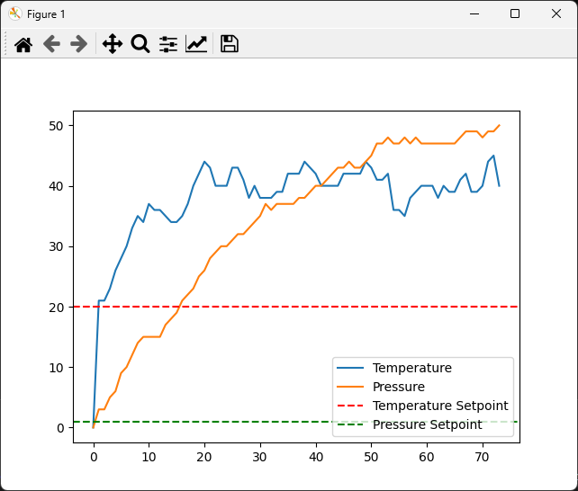

# Coding Assignment  

Control System Simulation coding assignment for the **Senior Real-Time Machine Software Developer** [role](https://candidate.hr-manager.net/ApplicationInit.aspx?cid=2723&ProjectId=143591&DepartmentId=18965&MediaId=5&SkipAdvertisement=False) at [ATLANT 3D](https://www.atlant3d.com/).

## Objective:

Your task is to develop a simulation for a Control System. The simulation will be used to control the temperature and pressure of a machine. The machine has two sensors that provide real-time readings of the temperature and pressure. The machine also has two parameters that can be adjusted to control the temperature and pressure. The goal of the simulation is to control the temperature and pressure of the machine by adjusting the parameters based on the sensor readings.

## Setup Instructions

1. Install the latest version of Python.

2. Install a C++ compiler. If you're using Windows, you can install MinGW. If you're using macOS, you can install the Xcode command line tools. If you're using Linux, you can install the `g++` package using your package manager.

3. Clone this repository to your local machine.

4. Navigate to the directory where you cloned the repository.

5. Create the Shared library using `g++ -m64 -shared -o control_system.dll control_system.cpp -lpthread`.

7. Install the required Python packages using `pip install -r requirements.txt`.

6. Run the python file using `python control_system.py`

You should see the following graph showing the real-time simulated temperature and pressure values of the system. However, as you can observe, as there is no control system implemented yet, the temperature and pressure values are not being controlled.

## Requirements:

### C++ Component 

Develop the core simulation engine in C++.

- You are provided a starting point in the file `control_system.cpp`.

- There are classes to model the Sensors, Controllers, and Control System. You may modify these classes as necessary, or add new classes depending on your solution.

- You may modify the model to generate the temperature and pressure sensor values in `run()`.

- Implement real-time control mechanisms to adjust machine parameters based on sensor inputs in the function `control()`. You may modify the PID controller as necessary, or implement a different controller.

- Implement multi-threading in your simulation, with one thread handling sensor input, another handling the PID controller, and another handling parameter adjustment.

- Implement data logging to a file in your simulation. The file should contain the sensor readings, machine parameters, and the time at which they were recorded.

### Python Component

Develop a Python interface for the simulation engine.

- You are provided a starting point in the file `control_system.py`. This file imports the C++ Shared library, calls the `run()` function and displays the sensor readings and machine parameters in real-time using matplotlib.

- Display real-time updates of the sensor readings and machine parameters over time during the simulation.

- Implement functionality to start, stop, and pause the simulation from the Python interface.

## Evaluation Criteria

Your solution will be evaluated on the following criteria:

- Correctness and completeness of the simulation.

- Use of object-oriented principles in the design of the simulation engine.

- Efficiency of the real-time control mechanisms.

- Usability and functionality of the Python interface.

- Quality of the code (including readability, comments, and adherence to coding standards).

- Handling of potential errors or exceptional conditions in the system.

- Add any tests you have written for your code either for the C++ component or the Python component.

- **You may choose to work more on the simulation engine component in C++ for this job role**. However, you are expected to have a basic understanding of both components.

## Submission Instructions

1. Fork this repository to your own GitHub account and make the forked repository private.

2. Clone the forked repository to your local machine.

3. Commit your changes to a new branch with the name `solution`.

4. Push your branch to the repository.

5. In your private repository, open a pull request from your branch to the `main` branch.

6. In the pull request description, provide a brief explanation of your solution and any decisions you made while developing it.

7. Finally, add the user of this repository as a collaborator to your private repository so that we can review your solution.

Please note: Do not open a pull request in the original public repository. Your solution should be submitted in your private repository only.

Please submit your complete code files along with a README that explains how to run your simulation. Include any assumptions or design decisions you made while developing the simulation.
